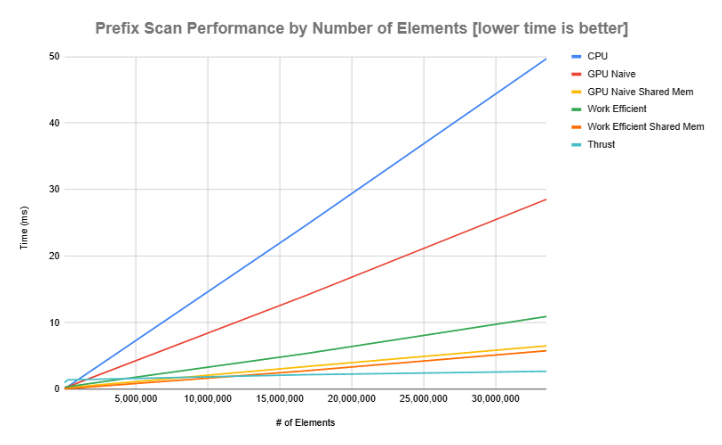
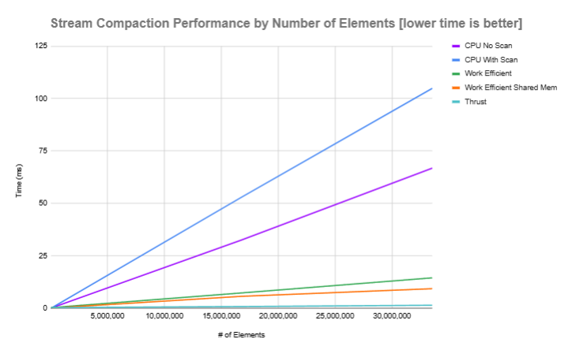
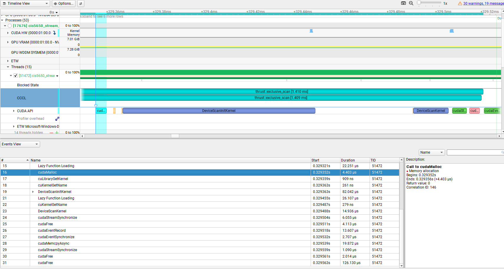

CUDA Stream Compaction
======================

**University of Pennsylvania, CIS 565: GPU Programming and Architecture, Project 2**

* Rose Kelly
  * [LinkedIn](www.linkedin.com/in/rose-kelly-b480b01a8)
* Tested on: Windows 11, i7-13700F @ 2.10 GHz 16GB, RTX 4060-Ti 8GB (Personal Computer)


### Features
* CPU Scan and Stream Compaction
* Naive GPU Scan and Stream Compaction
* Work Efficient Scan and Stream Compaction

#### EXTRA CREDIT FEATURES
* Optimize Work Efficient Scan and Stream Compaction
* Shared Memory Optimization for Naive Scan and Work Efficient Scan and Stream Compaction
### Performance Analysis







### Questions

* Roughly optimize the block sizes of each of your implementations for minimal
  run time on your GPU.
  * I optimized my block sizes for each implementation by looking at the nsight compute report when just that implementation was running and checking the times given in the program output. I ran the program with `2^25` elements when comparing times as this fairly large number gave me more consistent timing data. 
  
  * For the naive implementation, I saw the best performance with a block size of 1024. This had the highest Memory Throughput and Compute Throughput in Nsight Compute compared to other sizes. This makes sense as the larger block size may allow the scheduler to hide latency from the many global memory reads with other warps.

  * For the global memory work efficient approach, I saw the best performance with a block size of 32. This had the highest Memory Throughput in Nsight Compute (by just 0.15%) compared to other sizes and tied with 1024 for Compute Throughput. This may be because during the sweep up and sweep down, the number of actual threads required varies and gets to be below 1024 and even below 32. While my kernels exit early for global indices (combined block and thread index) outside the buffer size, there are still calculations in the kernel required to determine that. These few extra calculations on the unneeded threads being created at greater block sizes could be responsible for dragging performance slightly for larger block sizes, and also explain why block size of 32 has a slightly higher compute throughput.

* Compare all of these GPU Scan implementations (Naive, Work-Efficient, and
  Thrust) to the serial CPU version of Scan. Plot a graph of the comparison
  (with array size on the independent axis).
  * We wrapped up both CPU and GPU timing functions as a performance timer class for you to conveniently measure the time cost.
    * 


  * To guess at what might be happening inside the Thrust implementation (e.g.
    allocation, memory copy), take a look at the Nsight timeline for its
    execution. Your analysis here doesn't have to be detailed, since you aren't
    even looking at the code for the implementation.




  In the timeline above, we can see that the thrust scan calls cudaMalloc, a "DeviceScanInitKernel", "DeviceScanKernel" and cudaFree at the end. The cudaMalloc is likely allocating in and out buffers, as well as any helper device variables if those are used. And obviously cudaFree would be to free that allocated data. Without more information its hard to say what DeviceScanInitKernel and DeviceScanKernel do, but I would guess DeviceScanInitKernel is some kind of preprocessing kernel to manipulate the data to make the actual scan faster and take care of any needed buffer massaging. For example, in my various implementations, I have helper kernels to pad the input array with zero's if its not a power of 2, this DeviceScanInitKernel could do that if needed. DeviceScanKernel is likely the kernel that handles the actual scanning. I would guess Thrust uses shared memory optimization since my work efficient shared memory implementation is what comes the closest to Thrust's scan performance, but obviously it takes advantage of other optimizations as well since it clearly beats my implementation at higher numbers of elements. It is worth noting that thrust appears to perform worse than all of my scan implementations at very low numbers of elements and only beats all of them at roughly 10 million elements. This possibly could indicate more preprocessing/postprocessing on the input data that is overkill for smaller arrays but pays off for larger arrays. For example, it could indicate shared memory usage and the work required to split up arrays, scan them, and then combine them again since this adds overhead that could be visible at lower numbers of elements but pays off at higher numbers of elements.
    
* Write a brief explanation of the phenomena you see here.
  * Can you find the performance bottlenecks? Is it memory I/O? Computation? Is
    it different for each implementation?

For the naive implementation, Compute Throughput was fairly low (~10%) while memory throughput was high (~94%). This indicates memory I/O is the bottleneck since the compute throughput is likely lower due to wiating around for memory reads. This fits with the naive implementation since it relies heavily on global memory reads.

For the work efficient implementation, the Compute Throughput was even lower (~5%) while memory throughput was only slightly lower (~92%). This similarly indicates a memory I/O bottleneck. The global memory work efficient approach also makes many many global memory reads. My work efficient compact also has additional device buffers other than the the in and out buffers, as well as kernels to copy and scatter between buffers which requires more global memory reads. Additionally, the work efficient implementation should have fewer computations than the naive approach, so proportionally less time may be spent on compute rather than memory fetching.

* Paste the output of the test program into a triple-backtick block in your
  README.
```
****************
** SCAN TESTS **
****************
## SIZE: 268435456 ##
    [   1  11  22  13   3   1  11  15  35  20  23  21  27 ...  11   0 ]
==== cpu scan, power-of-two ====
   elapsed time: 418.738ms    (std::chrono Measured)
    [   0   1  12  34  47  50  51  62  77 112 132 155 176 ... -2015625525 -2015625514 ]
==== cpu scan, non-power-of-two ====
   elapsed time: 412.675ms    (std::chrono Measured)
    [   0   1  12  34  47  50  51  62  77 112 132 155 176 ... -2015625600 -2015625568 ]
    passed 
==== naive scan, power-of-two ====
   elapsed time: 260.424ms    (CUDA Measured)
    [   0   1  12  34  47  50  51  62  77 112 132 155 176 ... -2015625525 -2015625514 ]
    passed 
==== naive scan, non-power-of-two ====
   elapsed time: 266.939ms    (CUDA Measured)
    [   0   1  12  34  47  50  51  62  77 112 132 155 176 ... -1007830662 -1007830656 ]
    passed 
==== naive scan SHARED memory, power-of-two ====
   elapsed time: 49.922ms    (CUDA Measured)
    [   0   1  12  34  47  50  51  62  77 112 132 155 176 ... -2015625525 -2015625514 ]
    passed 
==== naive scan SHARED memory, non-power-of-two ====
   elapsed time: 57.6276ms    (CUDA Measured)
    [   0   1  12  34  47  50  51  62  77 112 132 155 176 ...  32  31 ]
    passed 
==== work-efficient scan, power-of-two ====
   elapsed time: 86.9138ms    (CUDA Measured)
    [   0   1  12  34  47  50  51  62  77 112 132 155 176 ... -2015625525 -2015625514 ]
    passed 
==== work-efficient scan, non-power-of-two ====
   elapsed time: 103.285ms    (CUDA Measured)
    [   0   1  12  34  47  50  51  62  77 112 132 155 176 ... -2015625600 -2015625568 ]
    passed 
==== work-efficient scan SHARED memory, power-of-two ====
   elapsed time: 44.7762ms    (CUDA Measured)
    [   0   1  12  34  47  50  51  62  77 112 132 155 176 ... -2015625525 -2015625514 ]
    passed 
==== work-efficient scan SHARED memory, non-power-of-two ====
   elapsed time: 61.9972ms    (CUDA Measured)
    [   0   1  12  34  47  50  51  62  77 112 132 155 176 ... -2015625600 -2015625568 ]
    passed 
==== thrust scan, power-of-two ====
   elapsed time: 10.621ms    (CUDA Measured)
    [   0   1  12  34  47  50  51  62  77 112 132 155 176 ... -2015625525 -2015625514 ]
    passed 
==== thrust scan, non-power-of-two ====
   elapsed time: 9.62269ms    (CUDA Measured)
    passed 

*****************************
** STREAM COMPACTION TESTS **
*****************************
    [   2   0   0   2   0   2   0   2   3   1   0   2   2 ...   1   0 ]
==== cpu compact without scan, power-of-two ====
   elapsed time: 516.191ms    (std::chrono Measured)
    [   2   2   2   2   3   1   2   2   3   2   1   2   1 ...   1   1 ]
    passed 
==== cpu compact without scan, non-power-of-two ====
   elapsed time: 522.803ms    (std::chrono Measured)
    [   2   2   2   2   3   1   2   2   3   2   1   2   1 ...   2   2 ]
    passed 
==== cpu compact with scan ====
   elapsed time: 897.259ms    (std::chrono Measured)
    [   2   2   2   2   3   1   2   2   3   2   1   2   1 ...   1   1 ]
    passed 
==== work-efficient compact, power-of-two ====
   elapsed time: 119.282ms    (CUDA Measured)
    [   2   2   2   2   3   1   2   2   3   2   1   2   1 ...   1   1 ]
    passed 
==== work-efficient compact, non-power-of-two ====
   elapsed time: 126.516ms    (CUDA Measured)
    [   2   2   2   2   3   1   2   2   3   2   1   2   1 ...   2   2 ]
    passed 
==== work-efficient compact SHARED memory, power-of-two ====
   elapsed time: 76.9705ms    (CUDA Measured)
    [   2   2   2   2   3   1   2   2   3   2   1   2   1 ...   1   1 ]
    passed 
==== work-efficient compact SHARED memory, non-power-of-two ====
   elapsed time: 85.8101ms    (CUDA Measured)
    [   2   2   2   2   3   1   2   2   3   2   1   2   1 ...   2   2 ]
    passed 
==== thrust compact, power-of-two ====
   elapsed time: 8.58301ms    (CUDA Measured)
    [   2   2   2   2   3   1   2   2   3   2   1   2   1 ...   1   1 ]
    passed 
==== thrust compact, non-power-of-two ====
   elapsed time: 8.68189ms    (CUDA Measured)
Press any key to continue . . . 
    [   2   2   2   2   3   1   2   2   3   2   1   2   1 ...   2   2 ]
    passed 

```

### Bloopers/Bugs

* Naive shared memory implementation worked when running on debug but NOT when running on release: the issue was that I had not actually implemented the double buffer that GPU Gems recommends because I tried it without it and it worked on Debug! Implementing the double buffer fixed it.
* Failure for arrays greater than 2048 in size: the issue was that I was getting floating point errors from using std::pow instead of just using the faster << operator for getting powers of 2.